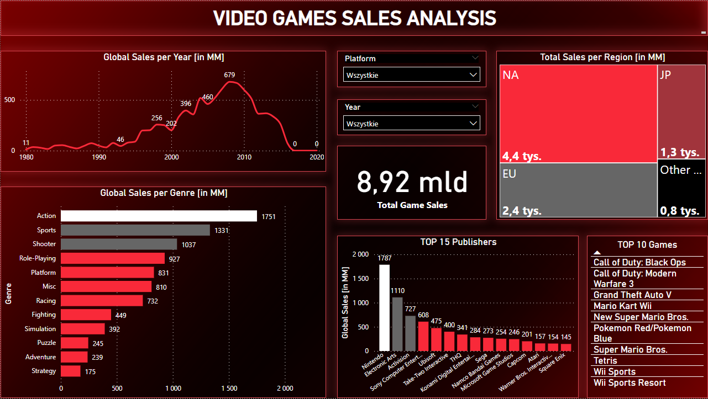

# Video Games Sales Analysis

### Project Overview
---
This project provides insights into video game sales statistics over the past 40 years.

 The dashboard brings information on how sales have staggered over the time, which region of the world, as well as genre, is the most profitable. Moreover, the top 15 publishers and the top 10 games of all time (based on the global sales) are highlighted.

The dashboard was made using the Power BI tool.

A preview of the dashboard below:

### Data Sources

The primary dataset used for the analysis was downloaded from [kaggle.com](https://www.kaggle.com/datasets/gregorut/videogamesales/data), where the author indicates vgchartz.com as the source.
